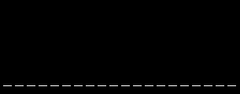
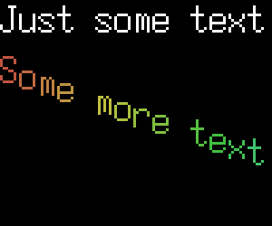
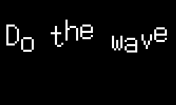

# lua-music-visualizer

This is a program to create videos from music files, using Lua. It's the successor
to my [mpd-visualizer](https://github.com/jprjr/mpd-visualizer) and keeps much of the
same API. It's able to decode audio from several formats (FLAC, MP3, WAVE, and raw PCM),
making it suitable for creating single videos offline, or for a never-ending livestream
with MPD.

Unlike `mpd-visualizer`, this only allows piping the raw video into some sub-process,
whether it's `ffmpeg`, `ffplay`. You can save videos locally using `ffmpeg` to encode,
or just use `cat` and redirect your standard output to a file if you want to save
the raw RGB video (warning: this will be a large file).

There's a CLI interface as well as a GUI interface.

# Supported formats:

* MP3
* FLAC
* WAVE
* Raw/headerless PCM
* M3U8 Playlists
* VGM/VGZ (disabled by default)
* NSF/NSFe/NSF2 (disabled by default)
* SPC (disabled by default)
* KSS/HES/AY/GBS/SGC (disabled by default)

## M3U8 Playlists

You can write comments in M3U8 playlists to override audio metadata, as well
as simulate sending messages on the `visualizer` MPD channel.

Metadata overrides apply to the next, upcoming track, and messages are "sent"
just before the next track begins to decode. For example:

```m3u8
# title A Custom Title
# artist A Custom Artist
/path/to/song.mp3 # this MP3's track and artist tags will be ignored and set
                  # to "A Custom Title" and "A Custom Artist", respectively.

# message some message
# "some message" will be sent on the "visualizer channel" as soon as song.mp3
# is done playing / just before the next track and will trigger on "onchange"
# call in your lua script.
# album A custom album
/path/to/song.wav # this WAV's album tag will be ignored and set to
                  # "A custom album"
```

# Usage

```bash
lua-music-visualizer \
  --about (shows licensing info and quits) \
  --width=1280 (video width) \
  --height=720 (video height) \
  --fps=30 (video fps) \
  --samplerate=48000 (input sample rate, only for raw PCM) \
  --channels=2 (input audio channels, only for raw PCM) \
  --resample=48000 (desired output sample rate, off by default) \
  -joff (disable JIT) \
  -l<modulename> (calls require("modulename") when Lua is initialized) \
  --probe (probes music file for meta info, ignores remaining paramters) \
  /path/to/song.mp3/flac/wave/raw \
  /path/to/lua/script.lua \
  prog args...
```

## MPD

`lua-music-visualizer` will connect to MPD if the `MPD_HOST` environment variable is set,
otherwise it won't connect.

On Unix/Linux, you can connect via TCP/IP or Unix sockets. On Windows, you can only
connect using TCP/IP.

If your MPD instances needs a password, use `MPD_HOST=password@hostname` or
`MPD_HOST=password@/path/to/socket`

If you need to connect on a different TCP port, set the `MPD_PORT` environment
variable.

## Requirements

* Lua or LuaJIT
* libsamplerate
* (optional) libavformat/libavcodec (ffmpeg)
* (optional) FFTW3
* (optional) [snes_spc](https://github.com/jprjr/snes_spc)
* (optional) [libid666](https://github.com/jprjr/libid666)
* (optional) [nsfplay](https://github.com/bbbradsmith/nsfplay)
* (optional) [libvgm](https://github.com/ValleyBell/libvgm)
* (optional) [libnezplug](https://github.com/jprjr/libnezplug)

Note that the optional libraries have different licensing, compiling against them
may make the resulting binary non-redistributable.

* FFTW3: GPL 2, resulting binary is non-redistributable?
  * TODO: Am I in violation of the GPL by optionally using FFTW3 in my non-GPL app?
* snes_spc: LGPL 2.1, no effect on redistribution/licensing.
* libid666: MIT, no effect on redistribution/licensing.
* libnezplug: public domain, no effect no redistribution.
* nsfplay: custom license, unsure of effect on redistribution/licensing.
* libvgm: unknown license, unsure of effect on redistribution/licensing.

## Installation

Hopefully you can just run `make`. Look at the Makefile if that doesn't work.

Different modules/decoders can be enabled/disabled with your `make` command. The available
parameters (and their default state) are:

* `ENABLE_LIBSAMPLERATE=1` -- allows for resampling with libsamplerate
* `ENABLE_FFMPEG=0` - builds the `lmv.video` module with libavformat/ffmpeg.
* `ENABLE_FFTW3=0` -- uses fftw3 for spectrum analyzers (default is KISS FFT)
* `ENABLE_PCM=1`
* `ENABLE_WAV=1`
* `ENABLE_MP3=1`
* `ENABLE_FLAC=1`
* `ENABLE_SPC=0` (requires `snes_spc` and `libid666`, see above for URLs)
* `ENABLE_NEZ=0` (requires `libnezplug`, see above for URL)
* `ENABLE_NSF=0` (requires `nsfplay`, see above for URL)
* `ENABLE_VGM=0` (requires `libvgm`, see above for URL)
* `ENABLE_ALL=0` (enables all decoders)

I've also included Docker files for cross-compiling to Windows, Linux, and OSX.

The OSX cross-compiler requires a copy of the macOS SDK. Long-story short, you'll
have to build your own local copy of my [macOS cross-compiler image](https://github.com/jprjr/docker-osxcross)
before using the Docker images.

I've added easy targets to the Makefile for using Docker:

* `make release` makes the standard release binaries.
    * Decodes raw PCM, WAV, FLAC, MP3
    * Uses libsamplerate
    * Uses LuaJIT
    * Uses KISSFFT
* `make everything` makes binaries with all decoders, which may not be redistributable.
    * Same as above, also decodes SPC, NSF/NSFe, VGM, HES, KSS, GBS, GBR, AY, SGC, NSD
    * Uses snes_spc
    * Uses NSFPlay
    * Uses libvgm
    * uses libnezplug

## What happens

When `lua-music-visualizer` starts up, it will attempt to open your songfile
and parse metadata. If the `MPD_HOST` environment variable is set, it will
connect to MPD.

Your Lua script should return either a function, or an object.

```lua
return function()
  print('making a video frame')
end
```

Or:

```lua
return {
  onframe = function(self)
    print('making a video frame')
  end
}
```

Or, if you want to be more object-oriented:

```lua
local M = {}
M.__index = M

function M.new()
  local self = {}
  setmetatable(self,M)
  return self
end

function M:onframe()
  print('making a video frame')
end

function M:onload()
  print('performing initialization stuff')
end

function M:onunload()
  print('shutting down')
end

function M:onchange(e)
  print('MPD saw a change, type: ' .. e)
end

function M:onreload()
  print('visualizer requested reload')
end

return M.new()
```

The only required function is `onframe`.

`onchange` is used when connected to MPD, and called whenever
a new message comes in, or the player status changes
(such as the song changing).

`onload` is called at app start-up, and `onunload` is called
when quitting.

`onreload` is used to signal a reload. The program does
*not* reload your main script, it just calls your own
`onreload` function, which you could use to perform your
own reloading procedures. On UNIX/Linux, the reload is
triggered by sending a `USR1` signal to the process.

For reference, here's all the function signatures you can expose:

* `onframe(self)`
* `onchange(self,event)`
* `onload(self)`
* `onunload(self)`
* `onreload(self)`


# The Lua environment

## Paths

Before any script is called, your Lua folder is added to the `package.path` variable,
meaning you can create submodules within your Lua folder and load them using `require`.

## Modules

There's some modules you can use in your lua scripts:

* `lmv.stream` - a module for interacting with the stream (drawing text, images, etc).
* `lmv.audio` - a module for getting audio info and creating spectrum analyzers.
* `lmv.color` - a module for calculating colors.
* `lmv.image` - a module for loading image files.
* `lmv.frame` - a module for creating image frames.
* `lmv.bdf` - a module for loading BDF fonts.
* `lmv.file` - a module for filesystem operations.
* `lmv.song` - a module for querying the current song, and to relay messages via MPD.
* `lmv.video` (if built with `ENABLE_FFMPEG=1`) - a module for decoding videos.

These can all be included with the standard `require`, like `local image = require('lmv.image')`

### The `lmv.stream` module

The `stream` module is a table with two keys.

* `stream.video` - an `lmv.frame` module, which represents the current frame of video. See
the section "The `lvm.frame` module for details.
  * `stream.video.framerate` - the video framerate
* `stream.audio` - an `lvm.audio` module, see the section "The `lmv.audio` module" for details.

The `stream` module has convenience methods for interacting with the video frame, for
example, instead of calling `stream.video:draw_rectangle()`, you can call
`stream:draw_rectangle()`.

### The `lmv.audio` module

The `audio` module contains some info about the audio stream, and a function for
creating a spectrum analyzer.

* `audio.samplerate` - has the current stream samplerate
* `audio.channels` - has the current stream channels
* `analyzer = audio.analyzer(bars)` - a function for creating a new
spectrum analyzer, that will calculate a given number of bars.

#### The spectrum analyzer

The result of `audio.analyzer(bars)` is a table with the following
fields:

* `analyzer.freqs` - an array-like table with the center frequency of
each bar
* `analyzer.amps` - an array-like table with the amplitude of each
bar, between 0.0 and 1.0
* `analyzer:update()` - a function to update the analyzer, should
be called on every frame.

### The `lmv.color` module

The `color` module contains utility functions for converting between color spaces.

* `r, g, b = color.hsl_to_rgb(h, s, l)`
  * converts a Hue, Saturation, and Lightness value to Red, Green, and Blue values.
  * `h` (Hue) should be between 0 and 359 (inclusive)
  * `s` (Saturation) should be between 0 and 100 (inclusive)
  * `l` (Lightness) should be between 0 and 100 (inclusive)
  * The returned red, green, and blue values will be between 0 and 255 (inclusive).

* `r, g, b = color.hsv_to_rgb(h, s, v)`
  * converts a Hue, Saturation, and Value value to Red, Green, and Blue values.
  * `h` (Hue) should be between 0 and 359 (inclusive)
  * `s` (Saturation) should be between 0 and 100 (inclusive)
  * `v` (Value) should be between 0 and 100 (inclusive)
  * The returned red, green, and blue values will be between 0 and 255 (inclusive).

* `h, s, l = color.rgb_to_hsl(r, g, b)`
  * Converts a Red, Green, and Blue value to Hue, Saturation, and Lightness.
  * `r`, `g`, and `b` should all be between 0 and 255 (inclusive).
  * The returned Hue will be between 0 and 359 (inclusive), saturation between 0 and 100, lightness between 0 and 100.

* `h, s, v = color.rgb_to_hsv(r, g, b)`
  * Converts a Red, Green, and Blue value to Hue, Saturation, and Value.
  * `r`, `g`, and `b` should all be between 0 and 255 (inclusive).
  * The returned Hue will be between 0 and 359 (inclusive), saturation between 0 and 100, value between 0 and 100.

### The `lmv.image` module

The `image` module can load most images, including GIFs. All images have a 2-stage loading process. Initially, it
just probes the image for information like height, width, etc. You can then load the image synchronously or asynchronously.
If you're loading images in the `onload` function (that is, at the very beginning of the program's execution), its safe
to load images synchronously. Otherwise, you should load images asynchronously.

* `img = image.new(filename, width, height, channels)`
  * Either filename is required, or `width/height/channels` if you pass `nil` for the filename
  * If filename is given, this will probe an image file. Returns an image object on success, nil on failure
    * If width, height, or channels is 0 or nil, then the image will not be resized or processed
    * If width or height are set, the image will be resized
    * If channels is set, the image will be forced to use that number of channels
      * Basically, channels = 3 for most bitmaps, channels = 4 for transparent images.
    * The actual image data is NOT loaded, use `img:load()` to load data.
  * If filename is nil, then an empty image is created with the given width/height/channels

* `loader = image.loader(queue size)`
  * Creates a new asynchronous image loader.
  * The size parameter is the maximum amount of queued images.
  * You pass the loader object to `img:load()`.
  * Call `loader.update` to copy images back into Lua.

Scroll down to "Image Instances" for details on image methods like `img:load()`

### The `lmv.frame` module

The `frame` module allows creating a single image frame, which you can then
perform drawing operations with.

* `frame = frame.new(width, height, channels, data)`
  * Creates a new frame with the given width, height, and color channels. `data`
  is an optional string of RGB or RGBA data to be copied into the image.
  * The frame will have all-zero values, so warning! This means in a 4-channel image,
  the Alpha value will be 0 (the image is fully transparent).

### The `lmv.bdf` module

The `bdf` module can load BDF (bitmap) fonts.

* `f = bdf.new(filename)`
  * Loads a BDF font and returns an object.
* `table = f.utf8_to_table(str)`
  * converts a string to a table of UTF-8 codepoints

Scroll down to "BDF Instances" for details on BDF methods.

### The `lmv.file` module.

The `file` module has methods for common file operations:

* `dir = file.ls(path)`
  * Lists files in a directory
  * Returns an array of file objects with two keys:
    * `file` - the actual file path
    * `mtime` - file modification time

* `dirname = file.dirname(path)`
  * Equivalent to the [dirname call](http://pubs.opengroup.org/onlinepubs/009696799/functions/dirname.html)

* `basename = file.basename(path)`
  * Equivalent to the [basename call](http://pubs.opengroup.org/onlinepubs/009696799/functions/basename.html)

* `realpath = file.realpath(path)`
  * Equivalent to the [realpath call](http://pubs.opengroup.org/onlinepubs/009696799/functions/realpath.html)

* `cwd = file.getcwd()`
  * Equivalent to the [getcwd call](http://pubs.opengroup.org/onlinepubs/009695399/functions/getcwd.html)

* `ok = file.exists(path)`
  * Returns `true` if a path exists, `nil` otherwise.


### The `lmv.song` module

The `song` module returns table with on the current song. The only guaranteed key is `elapsed`. Everything else can be nil.

If you're playing from a local FLAC/MP3/WAVE file, these will be pre-populated. If you're
connected to MPD, it may take a frame or two for these to be populated.

* `song.file` - the filename of the playing song
* `song.id` - the id of the playing song
* `song.elapsed` - the elapsed time of the current song, in seconds
* `song.total` - the total time of the current song, in seconds
* `song.title` - the title of the current song
* `song.artist` - the artist of the current song
* `song.album` - the album of the current song
* `song.message` - `lua-music-visualizer` uses MPD's [client-to-client](https://www.musicpd.org/doc/protocol/client_to_client.html) functionality, It listens on a channel named `visualizer`, if there's a new message on that channel, it will appear here in the song object.
* `song.sendmessage(msg)` - allows sending a message on the `visualizer` channel.

### The `lmv.video` module

The `video` module allows decoding images/videos with ffmpeg.

* `video.new(params)` - create a new `video` instance, `params` is a table with the following keys:
  * `url` - the url or path to the video you want to play.
  * `loops` - the number of times to (attempt) looping the input, set to 0 for infinite loops.
  * `colordepth` - the integer 3 or 4, basically whether you want an alpha channel.
  * `filters` - an array-like table of filters, each entry is another table with a single key and value pair.

The returned `video` instance is a userdata with the following functions:

* `video:frame()` - attempts to retrieve a new `frame` instance from the video.
* `video:status()` - check the status of the video thread, can be:
  * `loading` - probing/etc, but has not started decoding.
  * `ok` - decoding video
  * `done` - done decoding video
  * `error` - some error occured.
* `video:stop()` - stop the video decoder.

The video instance will always have some filters added automatically, after your own:

* `vflip` - technically all images in `lua-music-visualizer` are stored bottom-up,
* `format` - to convert to either `BGR` or `BGRA` format, how video is used internally.
* `fps` - to make the FPS match the main video FPS.

Here's an example of loading an MP4 file, resizing it, and putting the frames on the video.

```lua
local video = require'lmv.video'
local stream = require'lmv.stream'

local v, err = video.new({
  url = "example.mp4",
  loops = 0,
  filters = {
    { scale = 'w=320:h=-1' },
  },
})

if err then
  os.exit(1)
end

-- keep a reference to the previous frame once available
local frame

onframe = function()
  local newframe = v:frame()
  if newframe then
    frame = newframe
  end
  if frame then
    stream:stamp_frame(frame)
  end
}
```


## Image Instances

An image instance has the following methods and properties

* `img.state` - one of `error`, `unloaded`, `loading`, `loaded`, `fixed`
* `img.width` - the image width
* `img.height` - the image height
* `img.channels` - the image channels (3 for RGB, 4 for RGBA)
* `img.frames` - only available after calling `img:load`, an array of one or more frames
* `img.framecount` - only available after calling `img:load`, total number of frames in the `frames` array
* `img.delays` - only available after calling `img:load` - an array of frame delays (only applicable to gifs)
* `img:load(loader)` - loads an image into memory
  * `loader` is an optional object created by `image.loader` - if supplied, the image will be loaded
  using a background thread, otherwise the image is loaded immediately.
* `img:unload()` - unloads an image from memory

If `img:load()` fails, either asynchronously or synchronously, then the `state` key will be set to `error`

### Frame instances
Once the image is loaded, it will contain an array of frames. Additionally, `stream.video` is an instance of a `frame`

For convenience, most `frame` functions can be used on the `stream` object directly, instead of `stream.video`, ie,
`stream:get_pixel(x,y)` can be used in place of `stream.video:get_pixel(x,y)`

* `frame.width` - the frame width
* `frame.height` - the frame height
* `frame.channels` - the number of color channels in the frame (3 for RGB, 4 for RGBA)
* `frame.width_offset` - defaults to 0, a rotated frame will have this as a positive value.
* `frame.height_offset` - defaults to 0, a rotated frame will have this as a positive value.
* `r, g, b, a = frame:get_pixel(x,y)`
  * retrieves the red, green, blue, and alpha values for a given pixel
  * `x,y` starts at `1,1` for the top-left corner of the image
* `frame:set_pixel(x,y,r,g,b,a)` - sets an individual pixel of an image
  * `x,y` starts at `1,1` for the top-left corner of the image
  * `r, g, b` represents the red, green, and blue values, 0 - 255
  * `a` is an optional alpha value, 0 - 255
* `frame:set_pixel_hsl(x,y,r,g,b,a)` - sets a pixel using Hue, Saturation, Lightness
  * `x,y` starts at `1,1` for the top-left corner of the image
  * `h, s, l` represents hue (0-360), saturation (0-100), and lightness (0-100)
  * `a` is an optional alpha value, 0 - 255
* `frame:draw_rectangle(x1,y1,x2,y2,r,g,b,a)` - draws a rectangle from x1,y1 to x2, y2
  * `x,y` starts at `1,1` for the top-left corner of the image
  * `r, g, b` represents the red, green, and blue values, 0 - 255
  * `a` is an optional alpha value, 0 - 255
* `frame:draw_rectangle_hsl(x1,y1,x2,y2,h,s,l,a)` - draws a rectangle from x1,y1 to x2, y2 using hue, saturation, and lightness
  * `x,y` starts at `1,1` for the top-left corner of the image
  * `h, s, l` represents hue (0-360), saturation (0-100), and lightness (0-100)
  * `a` is an optional alpha value, 0 - 255
* `frame:set(frame)`
  * copies a whole frame as-is to the frame
  * the source and destination frame must have the same width, height, and channels values
* `frame:stamp_frame(stamp,x,y,flip,mask,a)`
  * stamps a frame (`stamp`) on top of `frame` at `x,y`
  * `x,y` starts at `1,1` for the top-left corner of the image
  * `flip` is an optional table with the following keys:
    * `hflip` - flip `stamp` horizontally
    * `vflip` - flip `stamp` vertically
  * `mask` is an optional table with the following keys:
    * `left` - mask `stamp`'s pixels left
    * `right` - mask `stamp`'s pixels right
    * `top` - mask `stamp`'s pixels top
    * `bottom` - mask `stamp`'s pixels bottom
  * `a` is an optional alpha value
    * if `stamp is an RGBA image, `a` is only applied for `stamp`'s pixels with >0 alpha
* `frame:blend(f,a)`
  * blends `f` onto `frame`, using `a` as the alpha paramter
* `frame:stamp_string(font,str,scale,x,y,r,g,b,max,lmask,rmask)`
  * renders `str` on top of the `frame`, using `font` (a font object)
  * `scale` controls how many pixels to scroll the font, ie, `1` for the default resolution, `2` for double resolution, etc.
  * `x,y` starts at `1,1` for the top-left corner of the image
  * `r, g, b` represents the red, green, and blue values, 0 - 255
  * `max` is the maximum pixel (width) to render the string at. If the would have gone past this pixel, it is truncated
  * `lmask` - mask the string by this many pixels on the left  (after scaling)
  * `rmask` - mask the string by this many pixels on the right (after scaling)
* `frame:stamp_string_hsl(font,str,scale,x,y,h,s,l,max,lmask,rmask)`
  * same as `stamp_string`, but with hue, saturation, and lightness values instead of red, green, and blue
* `frame:stamp_string_adv(str,props,userdata)`
  * renders `str` on top of the `frame`
  * `props` can be a table of per-frame properties, or a function
  * in the case of a table, you need frame 1 defined at a minimum
  * in the case of a function, the function will receive three arguments - the index, and the current properties (may be nil), and the `userdata` value
* `frame:stamp_letter(font,codepoint,scale,x,y,r,g,b,lmask,rmask,tmask,bmask)`
  * renders an individual letter
  * the letter is a UTF-8 codepoint, NOT a character. Ie, 'A' is 65
  * lmask specifies pixels to mask on the left   (after scaling)
  * rmask specifies pixels to mask on the right  (after scaling)
  * tmask specifies pixels to mask on the top    (after scaling)
  * bmask specifies pixels to mask on the bottom (after scaling)
* `frame:stamp_letter(font,codepoint,scale,x,y,h,s,l,lmask,rmask,tmask,bmask)`
  * same as `stamp_letter`, but with hue, saturation, and lightness values instead of red, green, blue
* tiled = frame:tile(width,height)
  * takes the current `frame`, and transforms it into a 2d array of frames, each is width x height.
  * The array is arranged as rows, then columns. 1,1 is the top-left.
  * `tiled[1][1]` is the top-left tile
  * `tiled[1][x]` is the (xth) column of the first row
  * `tiled[x][1]` is the top-most tile of the xth row
* frame = frame:rotate(degrees)
  * rotates a frame by the given degrees, which can be a integer or float
  * the returned frame will have `width_offset` and `height_offset` set as a positive value.
  * the returned frame will likely be larger than the original, the `_offset` fields are useful
    for maintaining a relative position.
    * example, if you're placing an image at x,y - but want to rotate it and keep
    the same position, you'd place the rotate image at x - width_offset, y - height_offset
  * rotating an already-rotated frame is technically possibly but not recommended

## BDF font instances

Loaded BDF fonts have the following properties/methods:

* `bdf:pixel(codepoint,x,y)`
  * returns true if the pixel at `x,y` is active
  * codepoint is UTF-8 codepoint, ie, 'A' is 65
* `bdf:pixeli(codepoint,x,y)`
  * same as `pixel()`, but inverted
* `bdf:get_string_width(str,scale)`
  * calculates the width of a rendered string
  * scale needs to be 1 or greater
* `bdf:utf8_to_table(str)`
  * converts a string to a table of UTF-8 codepoints

## Examples


### example: square

Draw a white square in the top-left corner:

```lua
local stream = require'lmv.stream'
return function()
  stream.video:draw_rectangle(1,1,200,200,255,255,255)
end
```

### example: stamp image

Load an image and stamp it over the video

```lua
local stream = require'lmv.stream'
local image = require'lmv.image'

local img = image.new('something.jpg')
img:load() -- load immediately

return {
    onframe = function()
      stream.video:stamp_frame(img.frames[1],1,1)
    end
}
```

### example: load image asynchronously

```lua
local image = require'lmv.image'
local stream = require'lmv.stream'
local loader = image.loader(10)
local img = image.new('something.jpg')
img:load(loader)

return function()
  loader:update() -- process any images loaded by this loader
  if img.state == 'loaded' then
    stream.video:stamp_frame(img.frames[1],1,1)
  end
end
```

### example: load a background

```lua
local stream = require'lmv.stream'
local image = require'lmv.image'
-- we specify the image should be resized to fit the stream's video frame
-- and use the same number of channels (RGB).
local bg = image.new('something.jpg',stream.video.width,stream.video.height,stream.video.channels)
bg:load()

return {
    onframe = function()
      -- since we know bg is the same dimensions and color depth as the video,
      -- we can use "set" to copy the entire frame in, instead of stamping it.
      stream.video:set(bg)
    end
}
```


### example: display song title

```lua
local bdf = require'lmv.bdf'
local song = require'lmv.song'
local stream = require'lmv.stream'
local font = bdf.new('some-font.bdf')

return {
    onframe = function()
      if song.title then
          stream.video:stamp_string(font,song.title,3,1,1)
          -- places the song title at top-left (1,1), with a 3x scale
      end
    end
}
```

### example: draw visualizer bars

```lua
local bar_height = 100 -- maximum bar height
local bar_width = 10 -- width of each bar
local bar_offset = 5 -- start at this x offset in the image
local bar_spacing = 5 -- number of pixels between bars

-- bars will be drawn at y=110 and above

local audio = require'lmv.audio'
local analyzer = audio.analyzer(20)

return {
    onframe = function()
        analyzer:update()
        for i=1,#analyzer.amps,1 do
            stream.video:draw_rectangle(
              bar_offset + (i-1)*(bar_width + bar_spacing),
              110 - (math.ceil(analyzer.amps[i] * bar_height)),
              bar_offset + (i-1)*(bar_width + bar_spacing) + bar_width,
              110,
              255, 255, 255) -- just draw a white box
        end
    end
}
```

Output:




### example: animate a gif

```lua
local image = require'lmv.image'
local frametime = 1000 / stream.video.framerate
-- frametime is how long each frame of video lasts in milliseconds
-- we'll use this to figure out when to advance to the next
-- frame of the gif

local gif = image.new('some-gif.gif')
gif:load()

return {
    onload = function()
      -- initialize the gif with the first frame and frametime
      gif.frameno = 1
      gif.nextframe = gif.delays[gif.frameno]
    end,
    onframe = function()
      stream.video:stamp_frame(gif.frames[gif.frameno],1,1)
      gif.nextframe = gif.nextframe - frametime
      if gif.nextframe <= 0 then
          -- advance to the next frame
          gif.frameno = gif.frameno + 1
          if gif.frameno > gif.framecount then
              gif.frameno = 1
          end
          gif.nextframe = gif.delays[gif.frameno]
      end
    end
}
```

### example: use `stamp_string_adv` with a function to generate a rainbow

```lua
local bdf = require'lmv.bdf'
local color = require'lmv.color'
local vga

local framecounter = 0
local colorcounter = 0

local function cycle_color(i, props)
  if i == 1 then
    colorcounter = colorcounter + 1
    props = {
      x = 1,
    }
  end
  if colorcounter == 36 then
    -- one cycle is 30 degrees
    -- we move 10 degrees per frame, so 36 frames for a full cycle
    colorcounter = 0
  end
  local r, g, b = color.hsl_to_rgb((colorcounter + (i-1) ) * 10, 50, 50)
  return {
    x = props.x,
    y = 50 + i * (vga.height/2),
    font = vga,
    scale = 3,
    r = r,
    g = g,
    b = b,
  }
end

local function onload()
  vga = bdf.load('demos/fonts/7x14.bdf')
end

local function onframe()
  stream:stamp_string(vga, "Just some text", 3, 1, 1, 255, 255, 255)
  stream:stamp_string_adv("Some more text", cycle_color )
  framecounter = framecounter + 1
  if framecounter == 300 then
    os.exit(0)
  end
end

return {
  onload = onload,
  onframe = onframe,
}
```

Output:



### example: use `stamp_string_adv` with a function to do the wave

```lua
local bdf = require'lmv.bdf'
local vga
local sin = math.sin
local ceil = math.ceil

local framecounter = 0
local sincounter = -1
local default_y = 30

local function wiggle_letters(i, props)
  if i == 1 then
    sincounter = sincounter + 1
    props = {
      x = 10,
    }
  end
  if sincounter == (26) then
    sincounter = 0
  end

  return {
    x = props.x,
    y = default_y + ceil( sin((sincounter / 4) + i - 1) * 10),
    font = vga,
    scale = 3,
    r = 255,
    g = 255,
    b = 255,
  }
end

local function onload()
  vga = bdf.load('demos/fonts/7x14.bdf')
end

local function onframe()
  stream:stamp_string_adv("Do the wave", wiggle_letters )
  framecounter = framecounter + 1
  if framecounter == 300 then
    os.exit(0)
  end
end

return {
  onload = onload,
  onframe = onframe,
}
```

Output:



### Example: previous wiggle-letters example, but object-oriented

```lua
local bdf = require'lmv.bdf'
local sin = math.sin
local ceil = math.ceil

local OODemo = {}
local OODemo__metatable = {
  __index = OODemo
}

-- returns a closure suitable for stream:stamp_string_adv
function OODemo:new_wiggle_letters()
  return function(i, props)
    if i == 1 then
      self.sincounter = self.sincounter + 1
      props = {
        x = 10,
      }
    end
    if self.sincounter == (26) then
      self.sincounter = 0
    end

    return {
      x = props.x,
      y = self.default_y + ceil( sin((self.sincounter / 4) + i - 1) * 10),
      font = self.vga,
      scale = 3,
      r = 255,
      g = 255,
      b = 255,
    }
  end
end

-- initialize default values, load a font, generate the closure
function OODemo:onload()
  self.framecounter = 0
  self.sincounter = -1
  self.default_y = 30
  self.vga = bdf.load('demos/fonts/7x14.bdf')
  self.wiggle_letters = self:new_wiggle_letters()
end

function OODemo:onframe()
  stream:stamp_string_adv("Do the wave", self.wiggle_letters )
  self.framecounter = self.framecounter + 1
  if self.framecounter == 300 then
    os.exit(0)
  end
end

return setmetatable({},OODemo__metatable)
```

# License

Unless otherwise stated, all files are released under
an MIT-style license. Details in `LICENSE`

Some exceptions:

* `src/dr_flac.h` - public domain, details found in file
* `src/dr_mp3.h` - public domain, details found in file
* `src/dr_wav.h` - public domain, details found in file
within the file.
* `src/stb_image.h` - public domain, details found in file
* `src/stb_image_resize.h` - public domain, details found in file
* `src/stb_leakcheck.h` - public domain, details found in file
* `src/jpr_proc.h` - public domain, details found in file
* `src/thread.h` - available under an MIT-style license or Public Domain, see file
for details.
* `src/_kiss_fft_guts.h` - BSD-3-Clause, see https://github.com/mborgerding/kissfft
* `src/kiss_fft.c` - BSD-3-Clause, see https://github.com/mborgerding/kissfft
* `src/kiss_fft.h` - BSD-3-Clause, see https://github.com/mborgerding/kissfft
* `src/kiss_fftr.c` - BSD-3-Clause, see https://github.com/mborgerding/kissfft
* `src/kiss_fftr.h` - BSD-3-Clause, see https://github.com/mborgerding/kissfft
* `src/asm.inc` - public domain, details found in file
* `src/attr.h` - public domain, details found in file
* `src/char.c` - public domain, details found in file
* `src/char.h` - public domain, details found in file
* `src/dir.c` - public domain, details found in file
* `src/dir.h` - public domain, details found in file
* `src/file.c` - public domain, details found in file
* `src/file.h` - public domain, details found in file
* `src/fmt.c` - public domain, details found in file
* `src/fmt.h` - public domain, details found in file
* `src/int.h` - public domain, details found in file
* `src/mat.h` - public domain, details found in file
* `src/norm.h` - public domain, details found in file
* `src/pack.c` - public domain, details found in file
* `src/pack.h` - public domain, details found in file
* `src/path.c` - public domain, details found in file
* `src/path.h` - public domain, details found in file
* `src/scan.c` - public domain, details found in file
* `src/scan.h` - public domain, details found in file
* `src/str.c` - public domain, details found in file
* `src/str.h` - public domain, details found in file
* `src/text.c` - public domain, details found in file
* `src/text.h` - public domain, details found in file
* `src/unpack.c` - public domain, details found in file
* `src/unpack.h` - public domain, details found in file
* `src/utf.c` - public domain, details found in file
* `src/utf.h` - public domain, details found in file
* `src/util.h` - public domain, details found in file
* `src/HandmadeMath.h` - public domain, see https://github.com/HandmadeMath/Handmade-Math/blob/master/LICENSE
* `src/headley.h` - public domain, see https://nemequ.github.io/headley

# Changes

## Version 2.0.0

Version 2.0.0 is a breaking change - there are no more global tables like `stream`, `image`, `song`, `font`.
These have been replaced with modules.

The CLI parameter `--bars` has been removed - you can now use `lvm.audio` to create your own analyzer.

# Known users

* [Game That Tune's 24/7 VGM Stream](https://twitch.tv/gttradio)
